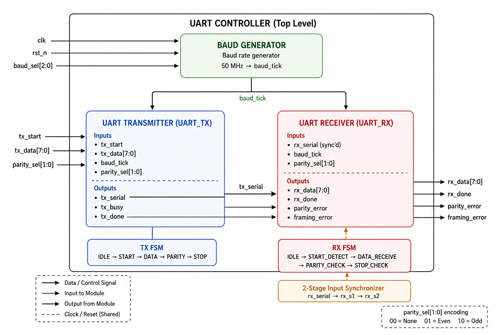
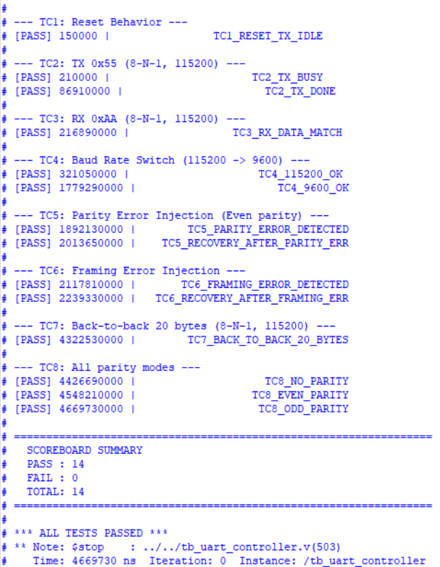
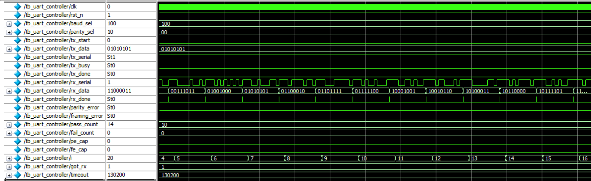
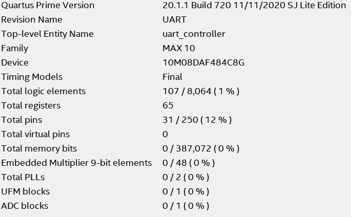

# UART Controller with Configurable Baud Rate and Parity Support

This repository contains the RTL design and verification of a configurable UART (Universal Asynchronous Receiver/Transmitter) Controller written in Verilog. The design supports multiple baud rates, selectable parity modes, error detection, and full-duplex serial communication through independent transmitter and receiver modules.

The project was implemented and synthesized using Intel Quartus Prime and verified using a self-checking Verilog testbench with scoreboard-based checking and error-injection testing.

---

# Design Overview

The UART controller provides asynchronous serial communication between digital systems using configurable baud rates and parity settings.

## Supported Features

- UART Transmitter (UART_TX)
- UART Receiver (UART_RX)
- Configurable Baud Rate Generator
- Multiple Baud Rate Support
- Optional Parity Generation and Checking
- Framing Error Detection
- 2-Stage Input Synchronizer for RX Path
- Self-Checking Verification Environment
- Error Injection Testing
- Back-to-Back Frame Verification

---

# Default Configuration

| Parameter | Value |
|------------|---------|
| System Clock | 50 MHz |
| Data Width | 8 Bits |
| Start Bits | 1 |
| Stop Bits | 1 |
| Baud Rates | 9600, 19200, 38400, 57600, 115200 |
| Parity Modes | None, Even, Odd |

---

# UART Architecture



*Figure 1: Top-level UART architecture showing the Baud Generator, UART Transmitter, UART Receiver, RX Synchronizer, and FSM-based control logic.*

The design consists of three major RTL modules:

---

## 1. Baud Rate Generator

The baud generator converts the 50 MHz system clock into baud ticks used by both transmitter and receiver.

### Supported Baud Rates

| baud_sel | Baud Rate |
|-----------|------------|
| 000 | 9600 |
| 001 | 19200 |
| 010 | 38400 |
| 011 | 57600 |
| 100 | 115200 |

The generated `baud_tick` signal ensures both TX and RX operate at identical communication speeds.

---

## 2. UART Transmitter (UART_TX)

The transmitter converts parallel data into a serial bit stream.

### Frame Format

```text
Start | Data[7:0] | Parity(Optional) | Stop
```

### Transmission Order

```text
LSB First
```

### TX FSM

```text
IDLE
  ↓
START
  ↓
DATA
  ↓
PARITY (Optional)
  ↓
STOP
  ↓
IDLE
```

### Outputs

- `tx_serial`
- `tx_busy`
- `tx_done`

### Supported Parity Modes

| parity_sel | Mode |
|------------|------|
| 00 | None |
| 01 | Even |
| 10 | Odd |

---

## 3. UART Receiver (UART_RX)

The receiver reconstructs serial data into parallel bytes while checking protocol correctness.

### RX FSM

```text
IDLE
  ↓
START_DETECT
  ↓
DATA_RECEIVE
  ↓
PARITY_CHECK
  ↓
STOP_CHECK
  ↓
IDLE
```

### Receiver Features

- Start-bit validation
- Data reception
- Parity verification
- Stop-bit verification
- Error reporting

### Outputs

- `rx_data`
- `rx_done`
- `parity_error`
- `framing_error`

---

## Clock Domain Protection

Incoming serial data may not be aligned with the system clock.

To reduce metastability risk, the receiver includes:

### 2-Stage Synchronizer

```text
rx_serial
    ↓
rx_s1
    ↓
rx_s2
```

### Benefits

- Improves reliability
- Prevents metastability propagation
- Common industry practice for asynchronous inputs

---

# Verification Environment

The UART was verified using a fully self-checking testbench developed in Verilog.

The testbench automatically:

- Generates UART frames
- Injects protocol errors
- Verifies received data
- Tracks pass/fail statistics
- Produces a scoreboard summary

No manual waveform inspection is required to determine correctness.

---

# Verification Methodology

## Directed Testing

Specific scenarios were created to verify:

- Reset behavior
- Normal transmission
- Normal reception
- Baud-rate switching
- Parity checking
- Framing-error handling
- Recovery after errors

## Scoreboard Checking

The testbench compares:

```text
Expected Data
        vs
Actual DUT Output
```

Any mismatch is immediately reported.

---

# Test Scenarios

## TC1 – Reset Verification

Verifies:

- TX remains idle after reset
- Correct default signal states

---

## TC2 – UART Transmission

Tests:

```text
Data = 0x55
Mode = 8-N-1
Baud = 115200
```

Checks:

- tx_busy assertion
- Successful frame completion

---

## TC3 – UART Reception

Tests:

```text
Data = 0xAA
Mode = 8-N-1
Baud = 115200
```

Checks:

- Correct byte reconstruction
- No error flags

---

## TC4 – Baud Rate Switching

Verifies operation at:

```text
115200 baud
↓
9600 baud
```

Checks dynamic baud selection functionality.

---

## TC5 – Parity Error Injection

Injects an incorrect parity bit.

Verifies:

- parity_error assertion
- Receiver recovery on subsequent valid frames

---

## TC6 – Framing Error Injection

Injects an invalid stop bit.

Verifies:

- framing_error assertion
- Proper receiver recovery

---

## TC7 – Back-to-Back Packet Reception

Transmits:

```text
20 consecutive UART frames
```

Checks:

- Continuous reception
- No data corruption
- No synchronization loss

---

## TC8 – All Parity Modes

### No Parity

```text
8-N-1
```

### Even Parity

```text
8-E-1
```

### Odd Parity

```text
8-O-1
```

Ensures correct parity generation and checking across all supported modes.

---

# Simulation Results

The complete verification suite successfully passed all test cases.

## Scoreboard Summary

| Metric | Result |
|----------|----------|
| PASS | 14 |
| FAIL | 0 |
| TOTAL | 14 |



*Figure 2: Self-checking scoreboard output showing successful completion of all directed test scenarios.*

---

# Waveform Results



*Figure 3: Simulation waveform showing UART frame reception, data reconstruction, and successful completion of the back-to-back transmission test.*

The waveform demonstrates:

- Serial data reception
- Correct byte reconstruction
- RX completion pulses
- Error-free operation
- Continuous frame handling

---

# FPGA Synthesis Results

The design was synthesized using Intel Quartus Prime Lite Edition targeting the Intel MAX 10 FPGA family.

## Device Information

| Parameter | Value |
|------------|----------|
| Device Family | MAX 10 |
| Device | 10M08DAF484C8G |
| Tool | Quartus Prime Lite 20.1 |

## Resource Utilization

| Resource | Usage |
|-----------|---------|
| Logic Elements | 107 / 8064 (1%) |
| Registers | 65 |
| Pins | 31 |
| Memory Bits | 0 |
| PLLs | 0 |



*Figure 4: Quartus synthesis report demonstrating extremely low FPGA resource utilization.*

---

# How to Run

## Clone Repository

```bash
git clone https://github.com/<your-username>/UART-Controller.git

cd UART-Controller
```

---

## Compile RTL

Compile the following files:

```text
baud_gen.v
uart_tx.v
uart_rx.v
uart_controller.v
tb_uart_controller.v
```

---

## ModelSim

```bash
vlog baud_gen.v
vlog uart_tx.v
vlog uart_rx.v
vlog uart_controller.v
vlog tb_uart_controller.v

vsim tb_uart_controller

run -all
```

---

## Quartus

1. Create a new Quartus project
2. Add all RTL files
3. Set:

```text
Top-Level Entity:
uart_controller
```

4. Compile the design

---

# Directory Structure

```text
UART-Controller/
│
├── rtl/
│   ├── baud_gen.v
│   ├── uart_tx.v
│   ├── uart_rx.v
│   └── uart_controller.v
│
├── tb/
│   └── tb_uart_controller.v
│
├── results/
│   ├── UART_BLOCK_DIAGRAM.png
│   ├── UART_Controller_TestCases.png
│   ├── UART_Controller_Waveform.png
│   └── UART_Controller_Resource_Utilization.png
│
└── README.md
```

---

# Features Summary

- Configurable UART Controller
- 50 MHz System Clock Support
- 9600–115200 Baud Rate Selection
- Even/Odd/No Parity Modes
- Framing Error Detection
- 2-Stage RX Synchronizer
- FSM-Based TX/RX Architecture
- Self-Checking Testbench
- Scoreboard-Based Verification
- Error Injection Testing
- Back-to-Back Frame Validation
- FPGA Synthesizable RTL
- Verified in ModelSim
- Synthesized on Intel MAX 10 FPGA

---

# Future Improvements

Potential enhancements include:

- 16× Oversampling Receiver
- Configurable Data Length (5–9 bits)
- Multiple Stop-Bit Support
- FIFO-Based TX/RX Buffers
- Interrupt Generation
- Hardware Flow Control (RTS/CTS)
- APB/AHB/AXI Peripheral Wrapper
- SystemVerilog Assertions (SVA)
- UVM-Based Verification Environment
- FPGA Hardware Demonstration with USB-UART Interface

---

# Project Outcome

This project demonstrates RTL design, FSM implementation, serial communication protocols, digital verification, FPGA synthesis, and error-detection mechanisms commonly encountered in FPGA, Digital Design, Embedded Systems, and VLSI design workflows.

It highlights:
- RTL design in Verilog
- FSM-based control architecture
- Serial communication protocol implementation
- Error detection and recovery mechanisms
- Self-checking verification methodology
- FPGA synthesis and resource analysis

making it a strong intermediate-level digital design project suitable for FPGA, RTL Design, Digital IC Design, and VLSI-oriented portfolios.
